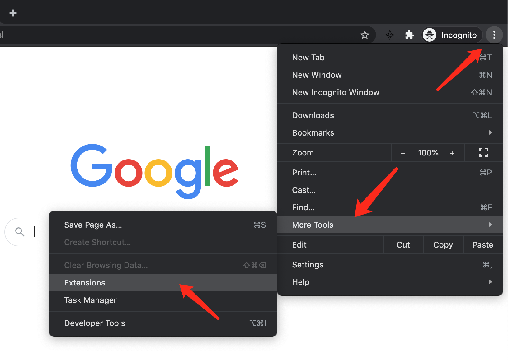
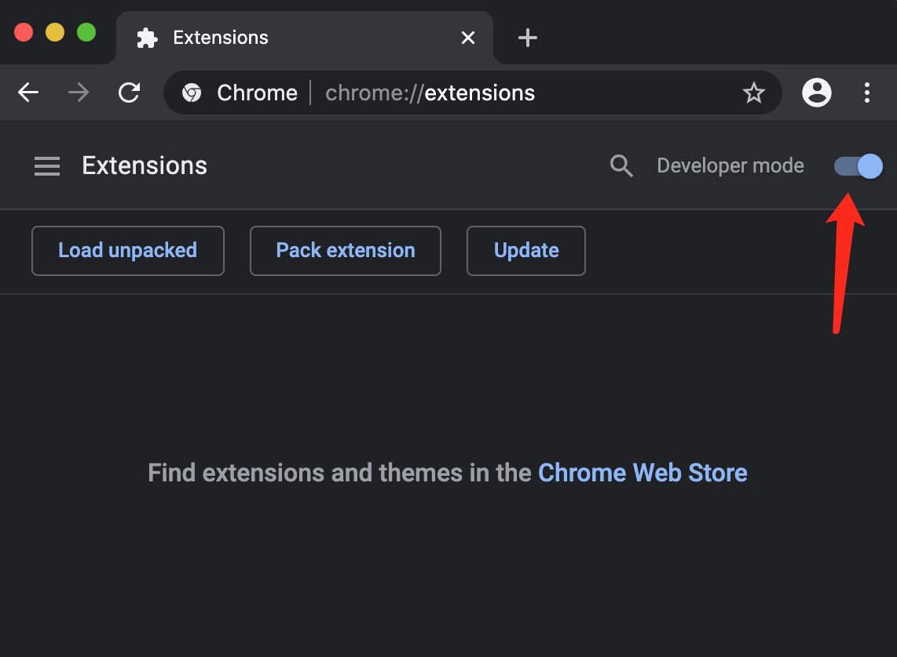
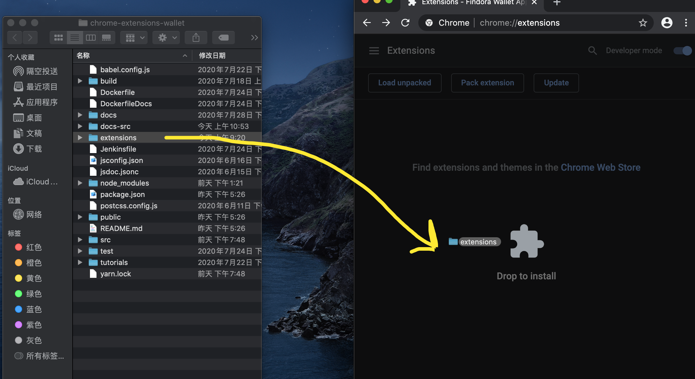
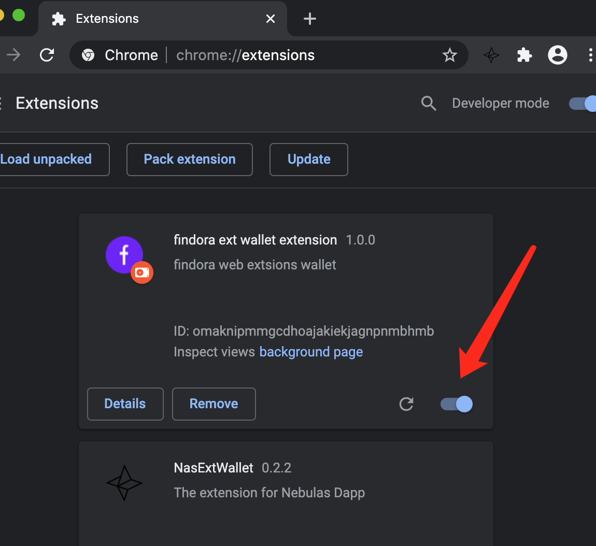
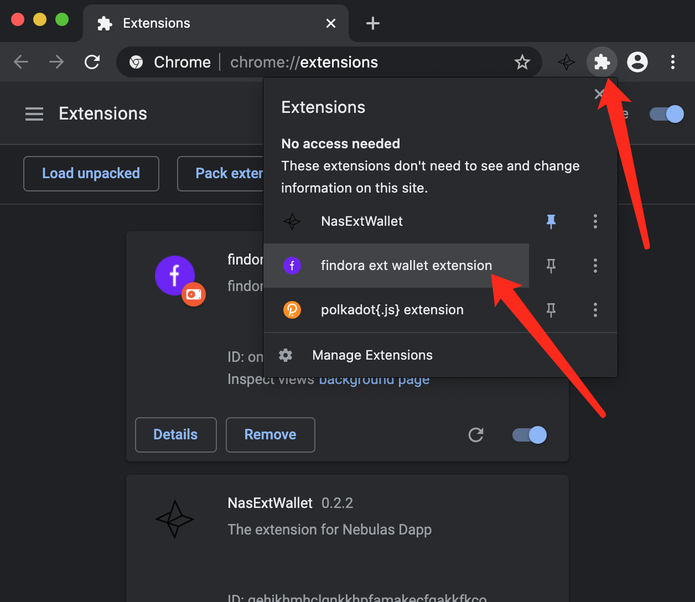
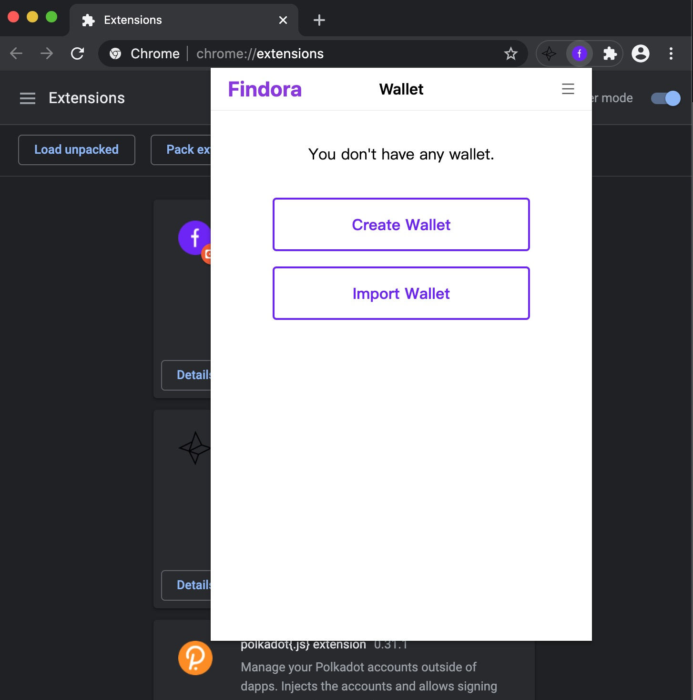

findora wallet browser extension project

## Framework configuration

react、react-router、mobx、webpack、less

## Branching

1. master - formal environment
2. dev/\* - development environment
3. bug/\* - bug recurrence environment

## Project begining:

### Preconditions:

1. Install [Node.js](https://nodejs.org/en/download/) globally (version >= v10.16.3 );
2. Install **yarn** package management tool globally;

```bash
$ npm install -g yarn
```

3. In the project directory, execute the following command:

```bash
$ yarn install
```

### Build development environment:

Execute the following commands in the project update directory to automatically open the browser and present the development environment.

```bash
$ yarn dev
```

> Open Google Chrome first, execute the command, the effect will be better!

### Build a production environment:

Execute the following commands in the project update directory to build resources for execution in the production environment.

```bash
$ yarn build
```

> The constructed resources are located in **" root directory/extensions "**

### Graphic introduction

> Open the browser extension panel
> 

> Open developer mode
> 

> Drag the plug-in to the extension panel
> 

> Open the wallet plugin
> 

> Use wallet plugin
> 

> Wallet plugin homepage
> 
