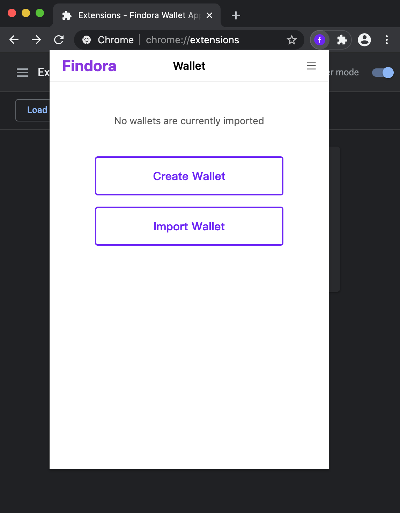

Findora Wallet Application - Instructions for Developers

## Framework configuration

react、react-router、mobx、webpack、less

## Branching

1. master - formal environment
2. dev/\* - development environment
3. bug/\* - bug recurrence environment

## Project begining:

### Preconditions:

1. Install [Node.js](https://nodejs.org/en/download/) globally (version >= v10.16.3 );
2. Install **yarn** package management tool globally;

```bash
$ npm install -g yarn
```

3. In the project directory, execute the following command:

```bash
$ yarn install
```

### Build development environment:

Execute the following commands in the project update directory to automatically open the browser and present the development environment.

```bash
$ yarn dev
```

> Open Google Chrome first, execute the command, the effect will be better!

### Build a production environment:

Execute the following commands in the project update directory to build resources for execution in the production environment.

```bash
$ yarn build
```

> The constructed resources are located in **" root directory/extensions "**

### Graphic introduction

> Open the browser extension panel
> 

> Open developer mode
> 

> Drag the plug-in to the extension panel
> 

> Open the wallet plugin
> 

> Use wallet plugin
> 

> Wallet plugin homepage
> 

### Tutorials

Refer to the tutorials linked in the navigation bar for instructions on trying out the wallet.

### Developer and Extension tips

#### [Learning WebAssembly (WASM)](https://www.rust-lang.org/what/wasm)

#### 1. Unable to use WASM in Google Chrome Extension

> Solution

Add the following to `manifest.json`.

```json
"content_security_policy": "script-src 'self' 'wasm-eval'; object-src 'self'"
```

#### 2. Unable to use WASM in Webpack

> Solution

Since the WASM used in the Findora Wallet Application is the `es6` module compiled from Rust, and Webpack doesn't support synchronously importing WASM modules, add the following to import WASM asynchronously.

```js
import('wasm');
```

With Webpack 4, in the `es6` module generated by `wasm-pack`, the following code will be included in `wasm.js` to import `wasm_bg.wasm`.

```js
import * as wasm from './wasm_bg.wasm';
```

#### Unexpected array conversion in Chrome.storage

> Example

```js
{
  data: [1, 2, 3, 4];
}
// Becomes
{
  data: [{ 0: 1 }, { 1: 2 }, { 2: 3 }, { 3: 4 }];
}
```

> Solution

1. Convert Object into string using `JSON.string()`.
2. Call `Chrome.storage.sync.set` to store data.

```js
{
  data: [1, 2, 3, 4];
}
// Stays the same
{
  data: [1, 2, 3, 4];
}
```
